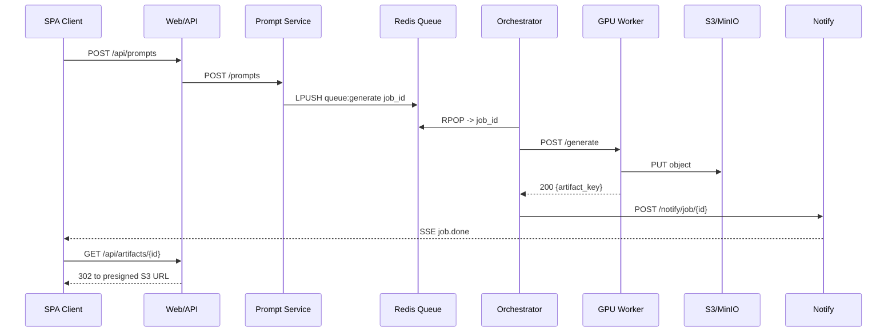
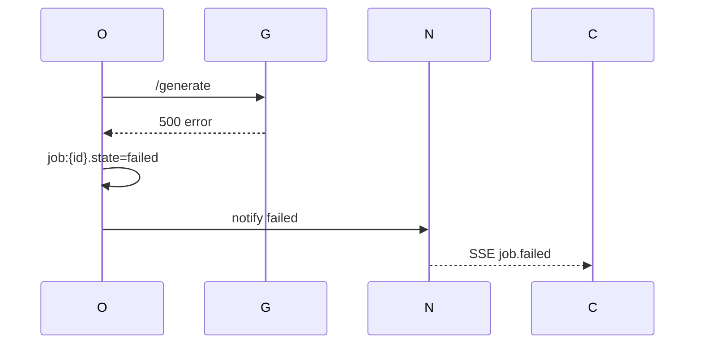

# Flows (E2E)

## Submit & generate (happy path)

## Failure: worker error

## Idempotency & retries (guidelines)

- Prompt Service should be idempotent for duplicate payloads (same client token)
- Orchestrator may retry a job once if worker returns 5xx in <2s.
